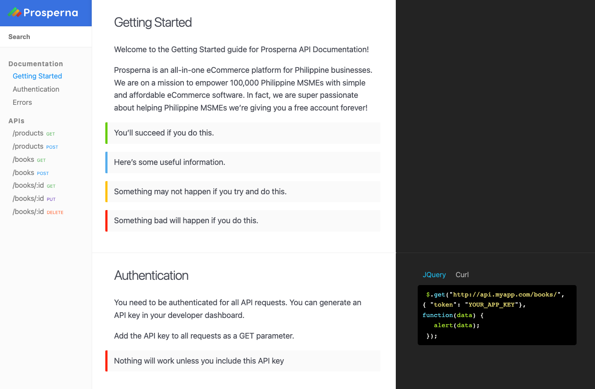

# Prosperna

API documentation for Prosperna. Browse through a [documenation](https://docs.prosperna.com/).
Start documenting your API with this configurable theme.

[](https://god.gw.postman.com/run-collection/22726848-d4428d72-2968-4fef-8ccb-4ce88e7177c9?action=collection%2Ffork&collection-url=entityId%3D22726848-d4428d72-2968-4fef-8ccb-4ce88e7177c9%26entityType%3Dcollection%26workspaceId%3Df139785f-cdb6-4a6d-b3c1-77d3e522e4a2)



## Features

- Three column layout
- Fully responsive
- Full text search
- Pre-styled components
- Auto-generated navigation based on category
- Optimised for editing in [CloudCannon](http://cloudcannon.com/)
- SEO tags
- Google Analytics

## Setup

1. Add your site and author details in `_config.yml`.
2. Get a workflow going to see your site's output (with [CloudCannon](https://app.cloudcannon.com/) or Jekyll locally).

## Develop

Aviator was built with [Jekyll](http://jekyllrb.com/) version 3.7.2, but should support newer versions as well.

Install the dependencies with [Bundler](http://bundler.io/):

```bash
$ bundle install
```

Run `jekyll` commands through Bundler to ensure you're using the right versions:

```bash
$ bundle exec jekyll serve
```

## Editing

Aviator is already optimised for adding, updating and removing documentation pages in CloudCannon.

### Usage

- Each section is a different collection, this helps organise your content.
- Set the order of the collections with the position_number field in collection configuration in `_config.yml`.
- Set the order of the documents inside a collection by setting the position_number in front matter.

### Search

- Add `excluded_in_search: true` to any documentation page's front matter to exclude that page in the search results.
